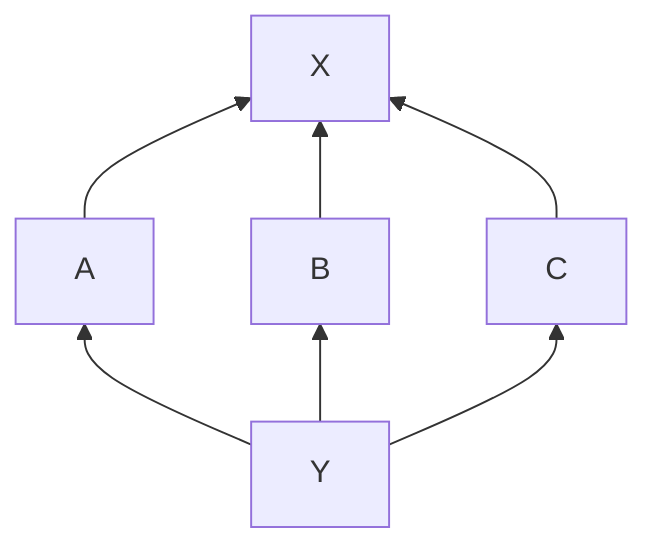
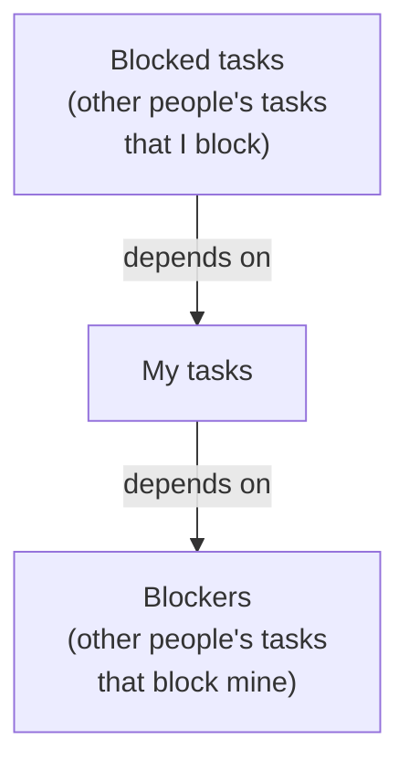

# Configuring Dagny Sync

Run **Configure Dagny Sync** from the Automation menu to connect your Dagny account and set up project mappings.

## Connecting to Dagny

The first time you configure, the plugin asks for your Dagny server URL, username, and password. These are stored securely in your system keychain. On subsequent runs, the plugin reuses the stored credentials automatically.

<!-- screenshot: connection form (Server URL / Username / Password) -->

## Choosing a Dagny project

After connecting, pick the Dagny project you want to sync. You can also create a new project from this screen.

If you have an OmniFocus project or folder selected when you run Configure, the plugin pre-fills matching values.

<!-- screenshot: project picker -->

## Mapping settings

### Map to

Determines where Dagny tasks appear in OmniFocus.

- **OmniFocus Project** -- all tasks sync into a single named project.
- **OmniFocus Folder** -- tasks sync into a folder. Dagny tasks marked as containers create sub-projects and sub-folders within it.
- **Everything** -- tasks sync across your entire OmniFocus database. Container tasks become top-level projects.

### OF Name

The name of the OmniFocus project or folder to sync into. Required for Project and Folder modes.

### Default Project (folder mode)

When using Folder mode, new tasks that don't belong to a container go into this OmniFocus project. If blank, they go into the first available project in the folder.

### Dependency mode

Controls how Dagny's dependency graph maps to OmniFocus's parent/child hierarchy when a perfect representation isn't possible.

OmniFocus uses parent/child trees, but Dagny uses a directed acyclic graph (DAG) where multiple tasks can share the same dependency. When the plugin can represent the graph losslessly in OmniFocus (by hoisting shared dependencies into a sequential ancestor), both modes produce the same result. When lossless representation isn't possible, the modes diverge:

- **Conservative (add edges)** -- makes the group sequential. All dependency relationships are preserved, but tasks that could run in parallel are forced to wait for each other.
- **Optimistic (drop edges)** -- keeps the group parallel. Tasks stay concurrent, but some dependency edges are lost (the first task in the group claims the shared dependency; siblings lose their connection to it).

#### Example

Three tasks A, B, C all depend on the same prerequisite X:



When there's a sequential ancestor (for example, a parent project), X is hoisted before the group and both modes produce the same result:

```
Project (sequential)
├── X
└── Y (parallel)
    ├── A
    ├── B
    └── C
```

When there's no sequential ancestor to hoist into, the modes differ:

| Mode         | Result                     | Trade-off                          |
| ------------ | -------------------------- | ---------------------------------- |
| Conservative | Y (sequential): X, A, B, C | C waits for B unnecessarily, which waits for A unnecessarily        |
| Optimistic   | Y (parallel): A→X, B, C    | B and C lose their dependency on X |

### Minutes per estimate unit

Dagny estimates are unitless. This multiplier converts them to OmniFocus minutes. For example, if one Dagny estimate unit represents 30 minutes, enter `30`.

<!-- screenshot: mapping settings form -->

## Team filtering

If you're working on a shared Dagny project, team filtering lets you sync only the tasks relevant to you.

### Team User

Select your name from the project member list, or "None" to sync all tasks.

When team filtering is active, the plugin syncs three categories of tasks:



- **My tasks** -- assigned to you (and unassigned, if enabled).
- **Blockers** -- assigned to others but blocking something you need to do. These get a `waiting on` tag in OmniFocus so you can see who to follow up with.
- **Blocked** -- assigned to others but waiting on your work. These appear in OmniFocus as context but auto-complete when their subtasks finish.

### Include Unassigned Tasks

When checked, tasks with no assignee are treated as "mine" and included in the sync.

### New Task Assignment

When you create a new task in OmniFocus and push it to Dagny:

- **Assign to me** -- the task is assigned to your Dagny account.
- **Leave unassigned** -- the task has no assignee in Dagny.

## Tag prefix

If you sync multiple Dagny projects, tag names might collide. A prefix namespaces Dagny tags in OmniFocus.

With prefix `"Work"` and a Dagny tag `bug`:

- The OmniFocus tag becomes `Work:bug`.
- When pushing back to Dagny, the prefix is stripped automatically.

**Always use prefix** -- when checked, the plugin always adds the prefix. When unchecked, it reuses an existing unprefixed tag if one already exists in OmniFocus.

## Status mapping

Each Dagny status maps to an OmniFocus action: Active, Completed, or Dropped.

<!-- screenshot: status mapping section of the form -->

For each action group, mark one status as the **default**. The default is used when translating OmniFocus status back to Dagny (for example, when you complete a task in OmniFocus, it gets the default "Completed" Dagny status).

Non-default active statuses get a `Dagny status:` tag in OmniFocus so you can distinguish between them (for example, "In Progress" vs. "Ready").
