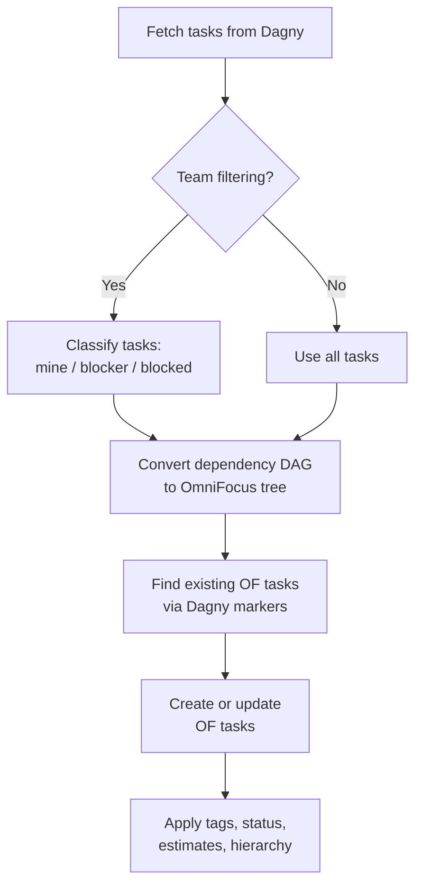
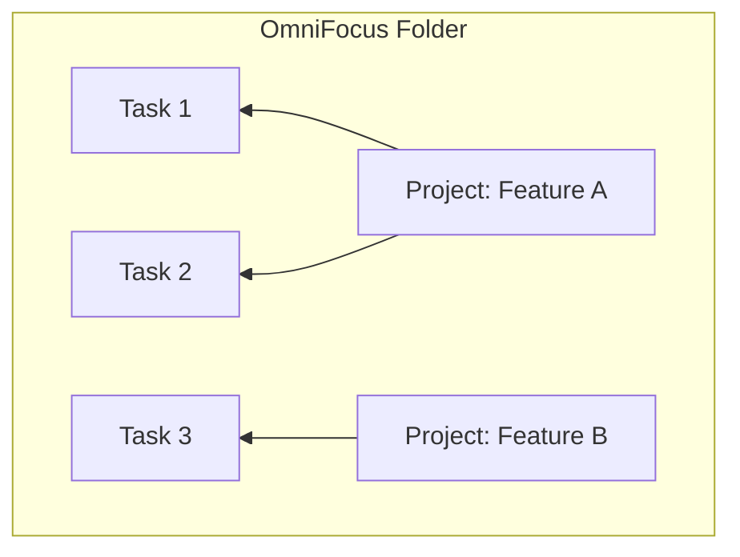

# Pulling from Dagny

**Pull from Dagny** fetches tasks from your Dagny projects and creates or updates the corresponding OmniFocus tasks.

## What happens during a pull



### 1. Fetch tasks

The plugin fetches all tasks from each mapped Dagny project, along with status definitions and team member information.

### 2. Filter by team (if configured)

When team filtering is active, tasks are classified:

- **Mine** -- tasks assigned to you (plus unassigned tasks, if that option is enabled).
- **Blockers** -- other people's tasks that are transitively blocking your work. The plugin walks backward through dependency chains to find these.
- **Blocked** -- other people's tasks that are transitively waiting on your work. The plugin walks forward through dependency chains to find these.

Tasks that don't fall into any category are skipped.

### 3. Convert dependencies to a tree

Dagny represents task dependencies as a directed acyclic graph (DAG), but OmniFocus uses a parent/child hierarchy. The plugin converts between them:

1. **Transitive reduction** -- removes redundant edges. If A depends on B and B depends on C, the direct A-to-C edge is unnecessary and gets dropped.
2. **Tree construction** -- groups dependencies into sequential and parallel structures based on their relationships.
3. **Flattening** -- simplifies nested sequential groups. A chain like C(seq) -> B(seq) -> A becomes a flat sequence [A, B, C].
4. **Priority sorting** -- within parallel groups, higher-priority tasks (and groups containing higher-priority descendants) sort first.

### 4. Match against existing OmniFocus tasks

Each synced OmniFocus task has a Dagny link at the end of its note (e.g., `❮❮Dagny❯❯` or `❮❮Dagny → GitHub: owner/repo#11❯❯`). The plugin reads the hyperlink URL to identify which Dagny task each OmniFocus task corresponds to. If no link is found, the plugin falls back to matching by task title.

### 5. Create or update tasks

For each task in the computed tree:

- **New task** -- creates an OmniFocus task in the correct position within the hierarchy.
- **Existing task** -- updates the task's fields and moves it to the correct position if the hierarchy changed.

## Field mapping

| Dagny        | OmniFocus           | Notes                                                                    |
| ------------ | ------------------- | ------------------------------------------------------------------------ |
| Title        | Name                |                                                                          |
| Description  | Note                | A Dagny link is appended at the end of the note; see below               |
| Estimate     | Estimated minutes   | Multiplied by the estimate multiplier                                    |
| Value > 0    | Flagged             | Based on the task's own value, not inherited priority                    |
| Status       | Action + status tag | See [Configuration](configuration.md#status-mapping)                     |
| Tags         | Tags                | Prefixed if configured; see [Configuration](configuration.md#tag-prefix) |
| Assignee     | `waiting on` tag    | Only for tasks assigned to someone else                                  |
| Dependencies | Hierarchy           | Via DAG-to-tree conversion                                               |

## Tag behavior

During pull, the plugin manages several tag families:

- **Regular tags** -- synced from Dagny, with optional prefix.
- **`Dagny status:` tags** -- added for non-default active statuses so you can see which Dagny status a task has (e.g., `Dagny status:In Progress`).
- **`waiting on:` tags** -- added for tasks assigned to other people. In team filtering mode, blockers get `waiting on:{username}` tags.

Tags from previous syncs that no longer apply are removed.

## Dagny link

After syncing, each OmniFocus task's note ends with a clickable link line:

```
❮❮Dagny → GitHub: owner/repo#11❯❯
```

- **Dagny** links to the task in Dagny's web interface.
- **GitHub: owner/repo#11** links to the associated GitHub issue or pull request (if one exists). Multiple GitHub links are comma-separated.

If the task has no GitHub link, the line is simply `❮❮Dagny❯❯`.

The link line is separated from the description by a blank line. You can edit the description freely; the link line is updated in place on each sync.

## Hierarchy mapping

### Project mode

All tasks land inside the named OmniFocus project. The tree structure determines the parent/child nesting within that project.

### Folder mode

Tasks are grouped by their container task in Dagny. Each container becomes an OmniFocus project inside the target folder. Tasks without a container go into the default project (if configured).



### Everything mode

Container tasks create top-level OmniFocus projects. The rest of the hierarchy works the same as folder mode.

## Blocked tasks in team mode

Tasks in the "blocked" category (other people's tasks waiting on your work) get special handling:

- They are marked with `completedByChildren = true`, so OmniFocus auto-completes them when all subtasks are done.
- Blocked tasks that end up as leaves (no children) are pruned from the tree, since there's nothing actionable about them.
