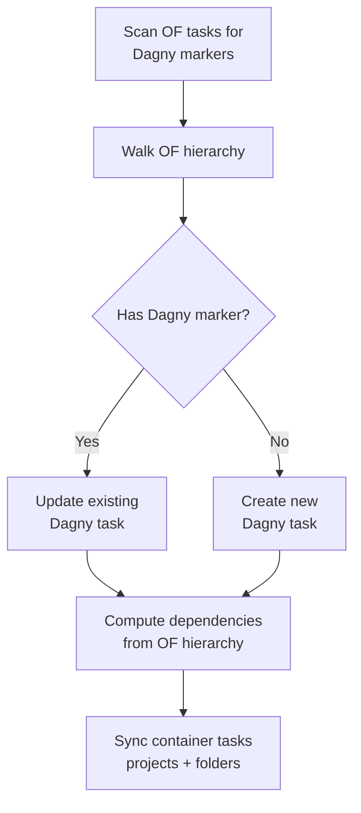
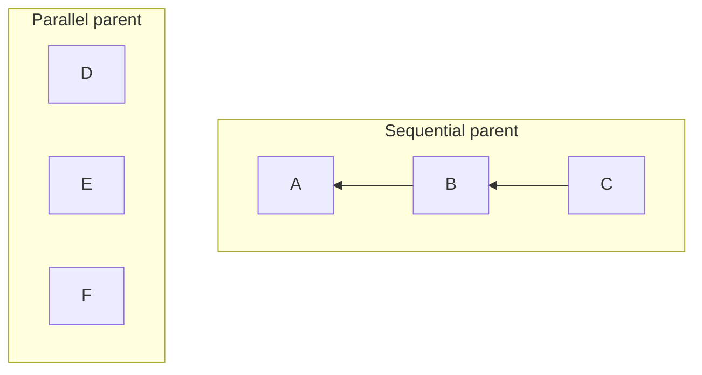

# Pushing to Dagny

**Push to Dagny** sends your OmniFocus changes back to Dagny, creating new tasks and updating existing ones.

## What happens during a push

### 1. Scan for markers

The plugin scans all OmniFocus tasks in the mapped target (project, folder, or everything) looking for Dagny link lines in task notes.

### 2. Walk the hierarchy

The plugin walks the OmniFocus task tree, processing siblings together to determine dependency relationships.

### 3. Update or create tasks

- **Marked tasks** -- the plugin computes a diff and sends a PATCH to update the Dagny task. The Dagny link line is stripped from the note before sending the description.
- **Unmarked tasks** -- treated as new. The plugin creates the task in Dagny and adds a Dagny link line to the OmniFocus task's note for future syncs.

### 4. Compute dependencies

OmniFocus hierarchy maps back to Dagny `dependsOn` edges:

- **Sequential siblings** -- each task depends on the previous one. Task B depends on A, task C depends on B.
- **Parallel siblings** -- all tasks depend on their parent's predecessor (the task that must complete before the parent group can start).
- **Tasks with children** -- a sequential parent depends on its last child. A parallel parent depends on all its children.

### 5. Sync container tasks (folder / everything mode)

After all regular tasks are processed, the plugin syncs structural tasks that represent OmniFocus projects and folders in Dagny:

- **Project containers** -- Dagny tasks whose `dependsOn` lists include all the child tasks of that OmniFocus project.
- **Folder containers** -- Dagny tasks whose `dependsOn` lists include the project and folder containers within that folder.

Folders are synced deepest-first so that nested folder structures resolve correctly.

## Field mapping

| OmniFocus                   | Dagny        | Notes                                                                           |
| --------------------------- | ------------ | ------------------------------------------------------------------------------- |
| Name                        | Title        |                                                                                 |
| Note                        | Description  | The Dagny link line at the end is stripped before sending                       |
| Estimated minutes           | Estimate     | Divided by the estimate multiplier                                              |
| Flagged                     | Value        | Flagged = value 1, unflagged = no value                                         |
| Action + status tag         | Status       | See [Configuration](configuration.md#status-mapping)                            |
| Tags                        | Tags         | Prefix stripped if configured; see [Configuration](configuration.md#tag-prefix) |
| `waiting on:{username}` tag | Assignee     | Resolved to Dagny user ID                                                       |
| Hierarchy                   | Dependencies | See dependency computation above                                                |

## Tag behavior

During push, the plugin skips internal tags:

- **`Dagny status:` tags** -- these are handled via status mapping, not sent as regular tags.
- **`waiting on:{username}` tags** -- these are converted to the `assigneeId` field instead of being sent as tags. Only usernames that match actual project members are recognized; other `waiting on:` tags are left alone.

If a tag prefix is configured, it’s stripped before sending. For example, `Work:bug:critical` with prefix `"Work"` is sent as `bug:critical`.

## Error handling

### Status transitions

Dagny may reject a status change if the transition isn't allowed by the project's workflow rules. When this happens, the plugin retries the update without the status change so that other field updates (title, description, etc.) still go through.

### New task assignment

When team filtering is active and you create a new task in OmniFocus:

- **Assign to me** -- the new Dagny task is assigned to your account.
- **Leave unassigned** -- the new Dagny task has no assignee, letting the team decide who picks it up.

## Summary

After pushing, the plugin shows a summary of how many tasks were created and updated.
